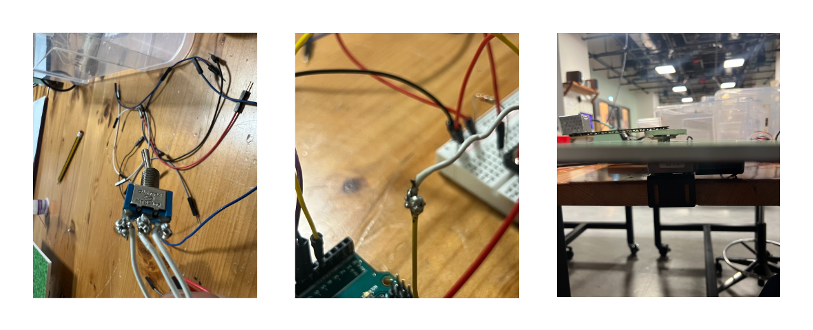
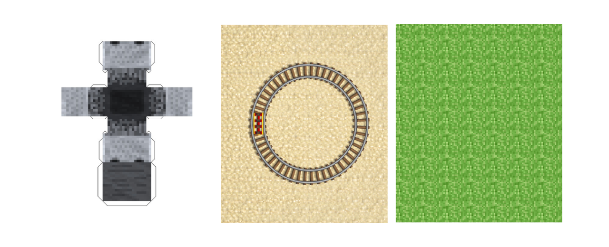
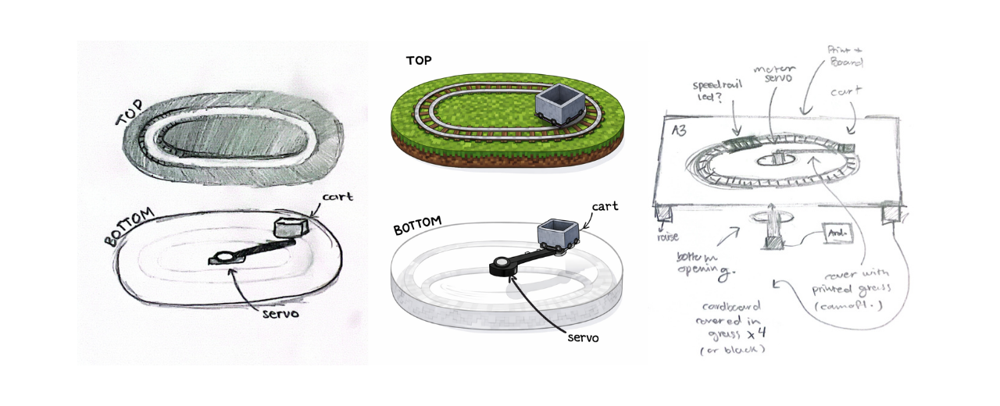
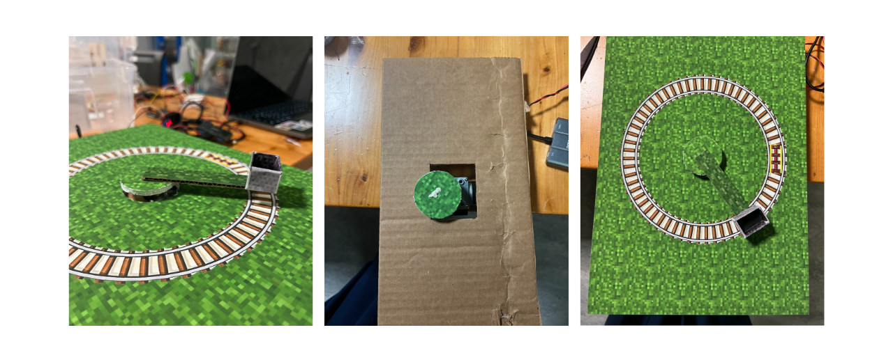
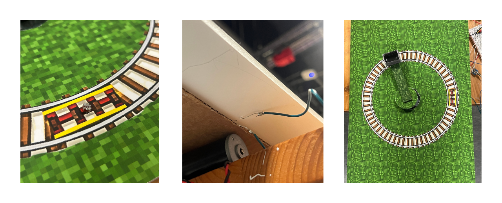
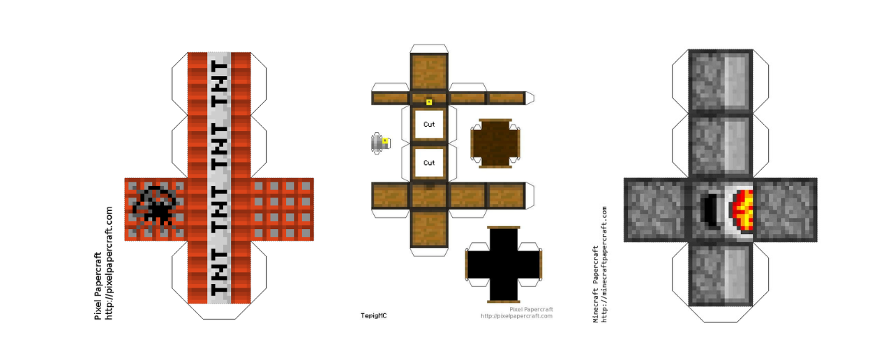
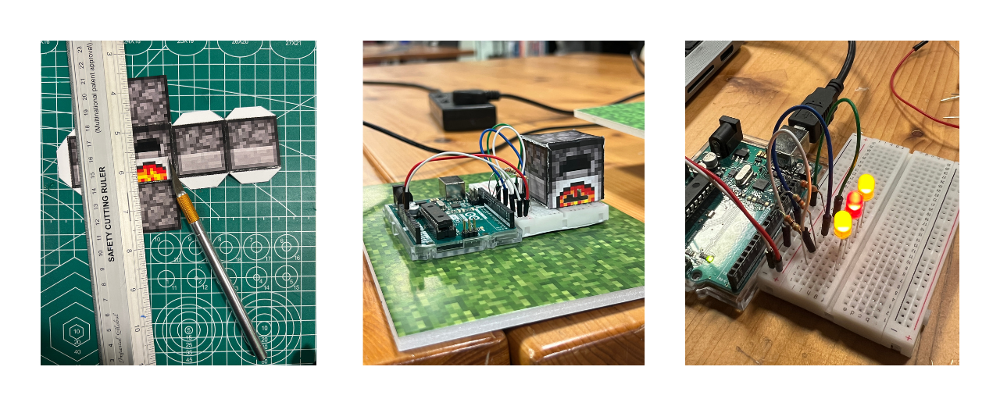
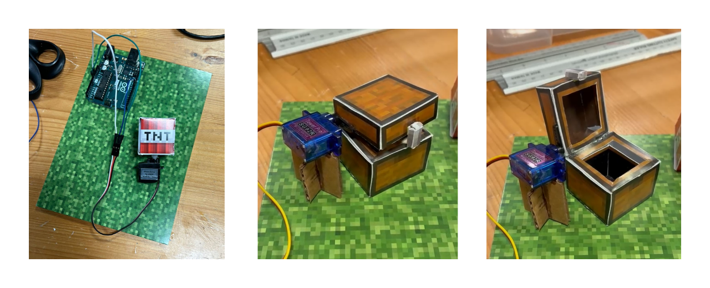

# Homework 1 (Jan 29)

This homework includes three history versions of the code ([link to homework](code/homework1_jan29)):

1. **Original code** – the starter example from the Adafruit Multitasking Tutorial (FILE CREATED)
2. **Button version** – modified so the servo stops sweeping when the button is not pressed (FIRST UPDATE)
3. **Potentiometer version** – extended to control the sweep speed using a potentiometer (SECOND UPDATE)

## Challenges & Debugging

During this process, I spent a lot of time debugging both the code and the wiring because the circuit was not behaving the way I expected. The main issue ended up not being the code at all, but the pushbutton on my breadboard. I initially assumed there was a logic or wiring mistake, but after checking different parts of the circuit, I replaced the physical button with another one and everything immediately worked. This taught me to consider hardware issues as well, not just software errors (something that also happened last week).

Another issue was completely my own mistake. The second servo was not moving at all, even though the code was correct. After some debugging, I realized that I had connected the servo to pin 6 instead of pin 9 because I was reading the pin numbers backwards. Once I fixed the pin connection to match the code, the servo worked normally.

To debug these issues, I changed one thing at a time and tested the circuit after each change. When something did not make sense, I simplified the setup and checked individual components, such as testing the button and servos separately. Through this process, I also learned that the speed of the servo sweep is controlled by a time interval rather than a delay. The potentiometer value is read and mapped to an interval, which determines how often the servo position is updated. When the interval is smaller, the updates happen more frequently and the servo sweeps faster, and when the interval is larger, the updates happen less frequently and the sweep is slower.

# Homework 2 (Feb 3)

First part was postponed due to not having access to the Scene Shop.


Following the video game theme, an idea that came to mind is using Minecraft as a direct reference to build a miniature world that functions the way the game does. The goal is to recreate a world that behaves through mechanics that already exist in the game. **Rails and minecart logic** could act as the main visible motion in the world. Everything would be built from blocks or cubes to create the environment, with a loose storyline embedded into it (possibly). There is a main player who has a house that exists in the world. Around it, mobs such as zombies, spiders, or skeletons are programmed to move or react to triggers. A skeleton might shoot arrows on a loop, a zombie could slowly approach the house, or an explosion effect could reference a creeper moment.

Other references from the game could include hidden piston doors that briefly open and close, trapdoors that drop or reveal spaces below, or underground Redstone paths that are partially exposed like a mined cave. Sound elements could activate when certain actions happen, giving feedback similar to the game. And noticing how in Minecraft there is a clear day and night cycle, the installation could play with that shift as well. When the installation is closed, the world exists in a “nighttime” state. The moment someone presses a button, the world switches to daytime.  

So, I sketched two (very rough) drawings based on what I had in mind. The first sketch on the left is more environmental. You can see a waterfall, greenery, and a small house on one side, and on the other side there’s a railway with a cart, maybe with some figures like zombies or other characters involved. The idea is that this sketch gives a glimpse of multiple elements at once, almost like a snapshot of the whole world. The second sketch is more focused on a central element, which is a treehouse. For me, that feels very typical of Minecraft. Around it, there’s a railway with a cart that I was imagining could hopefully move later on. 

With these two ideas, I think the main thing to consider is whether we want an environmental piece that tells a broader story, or a strong centerpiece for the project. The environmental approach could reflect last project’s city and skyscraper piece, or the boat and waves. The centerpiece approach would be more like a Ferris wheel or a merry-go-round: one larger, central structure that everything revolves around.

# Homework 3 (Feb 5)
After looking at previous projects from this class and analyzing the mechanical systems they used, I began thinking about how to physically represent a minecart railway system from Minecraft. In the game, minecarts move along tracks, with certain sections designed to briefly increase the cart’s speed before it returns to a steady motion. As an initial test, I plan to build a small circular railway so the cart’s movement is continuous and easy to observe.


One possible approach to achieving this movement is through a rotating wheel system. To create variations in speed, two different gear sizes could be used. Most of the loop would be driven by a larger gear, producing a slower, steady motion. At two specific points along the track, the cart would instead engage with a smaller gear, causing it to rotate faster and briefly increase the cart’s speed. These sections would be marked in red, referencing powered rails in Minecraft.


Another way to approach this is by using a gear movement from 507 Mechanical Movements ([Movement 223](https://507movements.com/mm_223.html)), which relies on uneven gear geometry to create periodic changes in speed during a continuous rotation. Because the gear is not evenly shaped, some parts of it transfer motion faster than others as it turns. This causes the output to alternate between slower and faster movement at predictable points in the cycle. Other ideas I considered include a skeleton repeatedly shooting an arrow using a simple pull-and-release mechanism, a character like Steve slowly floating upward to reference creative mode, or a TNT or creeper element that uses timed movement or light to suggest an explosion.

# Homework 4 (Feb 10/12)
I continued working on the motor exercise introduced in class. One of the main difficulties I ran into was soldering the on and off switch. The three pins at the bottom of the switch were very close together, and at first the solder kept spreading and accidentally connecting neighboring pins. This caused issues where the motor would not turn on or off properly. I fixed this by using less solder, working more slowly, and carefully separating each joint so that none of the pins were bridged. Another issue I encountered was related to wiring. I initially tried to insert a stranded wire directly into the Arduino header. This did not work well because the wire bent easily and made inconsistent contact. To solve this, I soldered a short solid core wire to the end of the stranded wire and then inserted the solid wire into the Arduino.  

Below is the code used for the exercise.

```cpp
#define enA    9
#define in1    6
#define in2    7
#define button 4

bool direction = false;
bool lastReading = HIGH;
bool stableState = HIGH;

unsigned long lastDebounceTime = 0;
const unsigned long debounceDelay = 30;

void setup() {
  pinMode(enA, OUTPUT);
  pinMode(in1, OUTPUT);
  pinMode(in2, OUTPUT);
  pinMode(button, INPUT_PULLUP);
  digitalWrite(in1, LOW);
  digitalWrite(in2, HIGH);
}

void loop() {
  int potValue = analogRead(A0);
  int pwmOutput = map(potValue, 0, 1023, 0, 255);
  analogWrite(enA, pwmOutput);
  bool reading = digitalRead(button);

  if (reading != lastReading) {
    lastDebounceTime = millis();
    lastReading = reading;
  }

  if (millis() - lastDebounceTime > debounceDelay) {
    if (reading != stableState) {
      stableState = reading;

      if (stableState == LOW) {
        direction = !direction;

        if (direction) {
          digitalWrite(in1, HIGH);
          digitalWrite(in2, LOW);
        } else {
          digitalWrite(in1, LOW);
          digitalWrite(in2, HIGH);
        }
      }
    }
  }
}
```
Using the above and my idea from last week, I began by creating a visual base for the mechanism.

I generated an image of Minecraft rails arranged in a perfect circle (which is not the case in minecraft). Getting this accurate enough to print was more challenging than expected. I placed the rails on a Minecraft grass background and printed the final image at A3 size on semi-glossy, semi-matte paper. After printing, I glued it onto a foam board to give it structural support. I cut a circular opening in the center of the board so the motor shaft could pass through and rotate freely. This solution was not part of my initial plan, but it allowed the motor to be integrated cleanly without interfering with the circular motion. 


Originally, I had planned to build the mechanism using two layers, as shown in my drawing. The idea was to place the motor between the layers, with the minecart moving above it. However, once I began thinking through the physical constraints, I realized this would require a structure to hold the top layer in place. That structure would likely interrupt the circular movement unless the entire mechanism was made much larger, with the support placed farther away from the track. Since this was meant to be a rough prototype, I decided to simplify the design and work with a single layer instead. For the moving element, I created a simple 3D template of a Minecraft minecart, cut it out, and glued it together. To connect it to the motor, I attached a vertical column (an arm) to the minecart.


In terms of Arduino, I programmed the motor to rotate continuously at a slow, steady speed, with a brief increase in speed once per cycle. The full rotation was treated as a virtual 360 degrees and divided in code using time rather than physical measurement. I used millis() to create a repeating timer that defines this cycle. When the timer reaches the set duration, the cycle restarts. During each cycle, the motor runs at a higher PWM value for a short boost period and a lower PWM value for the rest of the rotation. This speed change stands in for the powered rail sections marked in red in the concept. PWM, or Pulse Width Modulation, is how the Arduino controls motor speed without changing the voltage directly. Instead of sending a continuous power level, the Arduino rapidly switches the signal on and off. Higher PWM values produce faster rotation, while lower values result in slower movement.

Below is the updated code that reflects the current state of the mechanism.

```cpp
#define enA    9
#define in1    6
#define in2    7
#define button 4

bool direction = false;

//slower base, faster boost
const int slowPWM  = 55;
const int fastPWM  = 230;

//timing
const unsigned long cycleDuration = 4500; //long "rotation"
const unsigned long boostDuration = 180;  //short punch

unsigned long cycleStart = 0;

//button debounce
bool lastBtnReading = HIGH, btnStable = HIGH;
unsigned long btnDebounceT = 0;
const unsigned long btnDebounceDelay = 30;

void setup() {
  pinMode(enA, OUTPUT);
  pinMode(in1, OUTPUT);
  pinMode(in2, OUTPUT);
  pinMode(button, INPUT_PULLUP);

  digitalWrite(in1, LOW);
  digitalWrite(in2, HIGH);

  cycleStart = millis();
}

void loop() {
  // direction button
  bool b = digitalRead(button);
  if (b != lastBtnReading) {
    btnDebounceT = millis();
    lastBtnReading = b;
  }

  if (millis() - btnDebounceT > btnDebounceDelay) {
    if (b != btnStable) {
      btnStable = b;
      if (btnStable == LOW) {
        direction = !direction;
        if (direction) {
          digitalWrite(in1, HIGH);
          digitalWrite(in2, LOW);
        } else {
          digitalWrite(in1, LOW);
          digitalWrite(in2, HIGH);
        }
      }
    }
  }

  // fake 360° cycle
  unsigned long now = millis();
  unsigned long elapsed = now - cycleStart;

  if (elapsed >= cycleDuration) {
    cycleStart = now;
    elapsed = 0;
  }

  // speed profile
  int pwm = (elapsed < boostDuration) ? fastPWM : slowPWM;
  analogWrite(enA, pwm);
}
```

One issue I encountered is that the speed boost does not always occur at the exact same physical location. Since the motor setup does not include positional feedback, the system depends entirely on timing rather than actual rotation data. Small variations in motor speed accumulate over time, which caused the boost point to drift slightly. This is the current state of the prototype.

# Homework 5 (Feb 17)

To explore a different approach, I began with the idea of using a light sensor, where the cart would speed up when light conditions changed. My first step was observing the sensor values through the Serial Monitor to understand how the readings behaved. Even under seemingly stable lighting conditions, the values fluctuated slightly. This made it clear that analog input is never perfectly steady, which immediately affected how I thought about detection logic.



Initially, I experimented with fixed thresholds, checking whether the sensor value exceeded a specific number. While this approach worked conceptually, it quickly became apparent that small variations could unintentionally trigger events. To address this, I introduced a baseline that gradually adapts to the light level. Rather than reacting to how bright the environment was, I looked for sudden increases compared to what was normal at that moment. The difference between the current reading and the baseline became the main indicator of change.

From there, I adjusted the sensitivity by changing how big the detected change had to be. Smaller values reacted to tiny shifts, while larger values only responded to more obvious changes. Testing different settings helped me find a balance between being responsive and not triggering too easily. I also reduced the reaction time so the response felt quick and controlled instead of lasting too long. The result is not perfect, but it is fairly accurate. One issue I noticed is that the readings can be disrupted when something like a passing shadow briefly changes the light. Because of this, I would not consider the system fully reliable, even though it behaves as expected most of the time.

During brainstorming, Rashed suggested a few ideas for the Minecraft Machine Lab project. One idea was to divide the piece into sections based on the Nether, the Overworld, and The End. Another idea was a land and cave x ray layout. The land section would include surface elements like a farm, a house, or a furnace, along with small interactions such as a pig reacting to movement. The cave section would include underground elements like ores, minecarts with chests, lighting effects, and rotating objects. From these discussions, we decided on a few simple mechanisms to test, including LED lighting for a furnace effect, a shaking TNT interaction, and a treasure chest that opens and closes using a servo motor.

Below are the templates we used:



I tested using LEDs to simulate a furnace with slight light variations to imitate fire. 



Rashed and Stefania contributed to the TNT shaking mechanism using a servo motor. Rashed also worked on the treasure chest which opens and closes using a servo motor.


