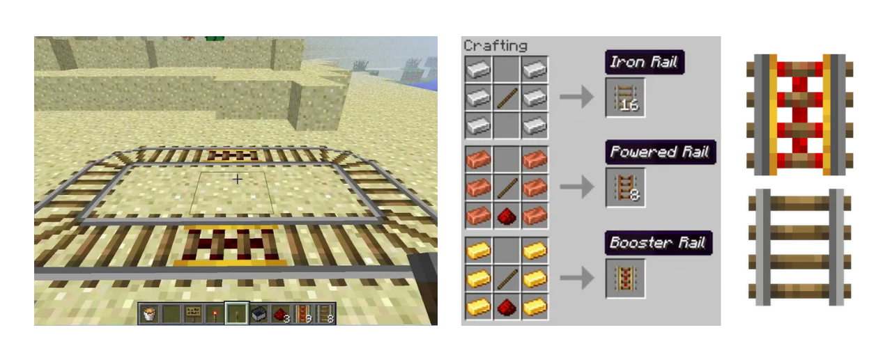

# Homework 1 (Jan 29)

This homework includes three history versions of the code ([link to homework](code/homework1_jan29)):

1. **Original code** – the starter example from the Adafruit Multitasking Tutorial (FILE CREATED)
2. **Button version** – modified so the servo stops sweeping when the button is not pressed (FIRST UPDATE)
3. **Potentiometer version** – extended to control the sweep speed using a potentiometer (SECOND UPDATE)

## Challenges & Debugging

During this process, I spent a lot of time debugging both the code and the wiring because the circuit was not behaving the way I expected. The main issue ended up not being the code at all, but the pushbutton on my breadboard. I initially assumed there was a logic or wiring mistake, but after checking different parts of the circuit, I replaced the physical button with another one and everything immediately worked. This taught me to consider hardware issues as well, not just software errors (something that also happened last week).

Another issue was completely my own mistake. The second servo was not moving at all, even though the code was correct. After some debugging, I realized that I had connected the servo to pin 6 instead of pin 9 because I was reading the pin numbers backwards. Once I fixed the pin connection to match the code, the servo worked normally.

To debug these issues, I changed one thing at a time and tested the circuit after each change. When something did not make sense, I simplified the setup and checked individual components, such as testing the button and servos separately. Through this process, I also learned that the speed of the servo sweep is controlled by a time interval rather than a delay. The potentiometer value is read and mapped to an interval, which determines how often the servo position is updated. When the interval is smaller, the updates happen more frequently and the servo sweeps faster, and when the interval is larger, the updates happen less frequently and the sweep is slower.

# Homework 2 (Feb 3)

First part was postponed due to not having access to the Scene Shop.

Following the video game theme, an idea that came to mind is using Minecraft as a direct reference to build a miniature world that functions the way the game does. The goal is to recreate a world that behaves through mechanics that already exist in the game. **Rails and minecart logic** could act as the main visible motion in the world. Everything would be built from blocks or cubes to create the environment, with a loose storyline embedded into it (possibly). There is a main player who has a house that exists in the world. Around it, mobs such as zombies, spiders, or skeletons are programmed to move or react to triggers. A skeleton might shoot arrows on a loop, a zombie could slowly approach the house, or an explosion effect could reference a creeper moment.

Other references from the game could include hidden piston doors that briefly open and close, trapdoors that drop or reveal spaces below, or underground Redstone paths that are partially exposed like a mined cave. Sound elements could activate when certain actions happen, giving feedback similar to the game. And noticing how in Minecraft there is a clear day and night cycle, the installation could play with that shift as well. When the installation is closed, the world exists in a “nighttime” state. The moment someone presses a button, the world switches to daytime.  

So, I sketched two (very rough) drawings based on what I had in mind. The first sketch on the left is more environmental. You can see a waterfall, greenery, and a small house on one side, and on the other side there’s a railway with a cart, maybe with some figures like zombies or other characters involved. The idea is that this sketch gives a glimpse of multiple elements at once, almost like a snapshot of the whole world. The second sketch is more focused on a central element, which is a treehouse. For me, that feels very typical of Minecraft. Around it, there’s a railway with a cart that I was imagining could hopefully move later on. 

With these two ideas, I think the main thing to consider is whether we want an environmental piece that tells a broader story, or a strong centerpiece for the project. The environmental approach could reflect last project’s city and skyscraper piece, or the boat and waves. The centerpiece approach would be more like a Ferris wheel or a merry-go-round: one larger, central structure that everything revolves around.

# Homework 3 (Feb 5)
After looking at previous projects from this class and analyzing the mechanical systems they used, I began thinking about how to physically represent a minecart railway system from Minecraft. In the game, minecarts move along tracks, with certain sections designed to briefly increase the cart’s speed before it returns to a steady motion. As an initial test, I plan to build a small circular railway so the cart’s movement is continuous and easy to observe.

One possible approach to achieving this movement is through a rotating wheel system. To create variations in speed, two different gear sizes could be used. Most of the loop would be driven by a larger gear, producing a slower, steady motion. At two specific points along the track, the cart would instead engage with a smaller gear, causing it to rotate faster and briefly increase the cart’s speed. These sections would be marked in red, referencing powered rails in Minecraft.

Another way to approach this is by using a gear movement from 507 Mechanical Movements ([Movement 223](https://507movements.com/mm_223.html)), which relies on uneven gear geometry to create periodic changes in speed during a continuous rotation. Because the gear is not evenly shaped, some parts of it transfer motion faster than others as it turns. This causes the output to alternate between slower and faster movement at predictable points in the cycle. Other ideas I considered include a skeleton repeatedly shooting an arrow using a simple pull-and-release mechanism, a character like Steve slowly floating upward to reference creative mode, or a TNT or creeper element that uses timed movement or light to suggest an explosion.

